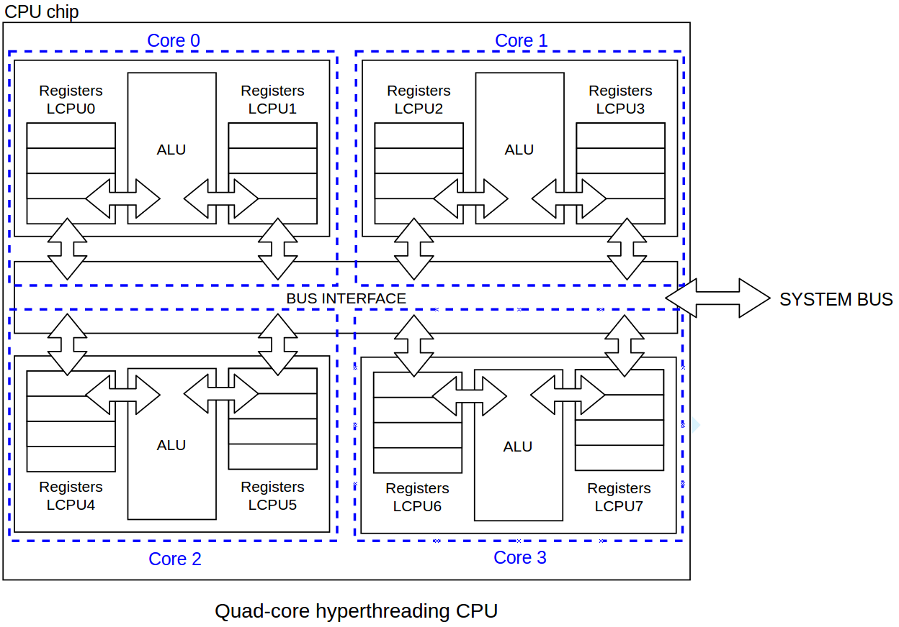

# PL04

**Data**: 04-11-2021

## Informações sobre o aluno

**Nome**: José Pedro Ribeiro Peixoto<br>
**Número**: PG47381<br>
**Curso**: Mestrado em Engenharia Informática<br>

---

## Notas da aula


--- 

## Resolução de Exercícios

### **1.** The basic OpenMP construct: the parallel region

```c
#include<omp.h> 
#include<stdio.h> 
 
int main() { 
    printf("master thread\n"); 
#pragma omp parallel num_threads(2) 
    for(int i=0;i<100;i++) { 
        int id = omp_get_thread_num(); 
        printf("T%d:i%d ", id, i); 
    } 
    printf("master thread\n"); 
}
```

#### **a)**  The order of the output is always the same across multiple runs? Why?

Não, devido a race conditions (?) as threads não escrevem sequencialmente 0..99.

#### **b)** The order of the output OF EACH thread is always the same? Why? 

Sim, cada threads escreve de 0..99 (embora no output global possa ter outra thread a escrever algo a meio).

#### **c)** How is the loop execution distributed (i.e., scheduled) between threads?

A carga não é divida e, por isso, ambos executam as mesmas instruções.

---

### **2.** Work sharing and synchronization 

#### **2.1**

```c
#include<omp.h> 
#include<stdio.h> 
 
int main() { 
    printf("master thread\n"); 
#pragma omp parallel num_threads(2) 
#pragma omp for
    for(int i=0;i<100;i++) { 
        int id = omp_get_thread_num(); 
        printf("T%d:i%d ", id, i); 
    } 
    printf("master thread\n"); 
}
```

#### **2.2**

```c
#include<omp.h> 
#include<stdio.h> 
 
int main() { 
    printf("master thread\n"); 
#pragma omp parallel num_threads(2) 
#pragma omp master
    for(int i=0;i<100;i++) { 
        int id = omp_get_thread_num(); 
        printf("T%d:i%d ", id, i); 
    } 
    printf("master thread\n"); 
}
```

#### **2.3**

```c
#include<omp.h> 
#include<stdio.h> 
 
int main() { 
    printf("master thread\n"); 
#pragma omp parallel num_threads(2) 
#pragma omp single
    for(int i=0;i<100;i++) { 
        int id = omp_get_thread_num(); 
        printf("T%d:i%d ", id, i); 
    } 
    printf("master thread\n"); 
}
```

#### **a)** In 2.1/2.2/2.3, how is the loop execution distributed (i.e., scheduled) between threads?

##### **2.1**

A carga é dividida igualmente pelas duas threads.

##### **2.2**

Se só a master thread é que vai executar o bloco de instruções, então não há divisão de carga.  

##### **2.3**

Se apenas uma thread pode executar o bloco de instruções (a primeira que entrar - race condition), então não há divisão de carga.

#### **b)** In 2.1/2.2/2.3, the loop  division is always the same? 

##### **2.1**

Não. Quantitativamente é igual entre as duas threads. No entanto, as iterações que cada um fica depende da decisão do scheduler. 

##### **2.2**

Sim, porque apenas uma thread executa o bloco de código.

##### **2.3**

Sim, porque apenas uma thread executa o bloco de código.

#### **2.4**


```c
#include<omp.h> 
#include<stdio.h> 
 
int main() { 
    printf("master thread\n"); 
#pragma omp parallel num_threads(2) 
#pragma omp critical
    for(int i=0;i<100;i++) { 
        int id = omp_get_thread_num(); 
        printf("T%d:i%d ", id, i); 
    } 
    printf("master thread\n"); 
}
```

#### **c)** In 2.4, the order of the output is always the same? What kind of synchronization occurs? 

Há uma zona crítica e, portanto, apenas uma thread pode aceder àquela região de cada vez. Portanto, cada uma das threads vai executar o bloco inteiro, mas sequencialmente.

---

### **3.** Synchronization 

#### **3.1.** Include a barrier inside the loop, after the printf statement (`#pragma omp barrier`).

```c
#include<omp.h> 
#include<stdio.h> 
 
int main() { 
    printf("master thread\n"); 
#pragma omp parallel num_threads(2) 
    for(int i=0;i<100;i++) { 
        int id = omp_get_thread_num(); 
        printf("T%d:i%d ", id, i); 
#pragma omp barrier
    } 
    printf("master thread\n"); 
}
```

#### **a)** The order of the output is always the same? What kind of synchronization occurs?

Não. A barreira obriga as threads apenas avançam quando **todas** as threads atingem essa barreira. Sendo assim e neste caso (for loop), há possibilidade (embora pequena) que a mesma thread escreva duas vezes consecutivas (teria de acabar em último e logo a seguir ser a primeira).

#### **3.2.** Include the directive `#pragma omp ordered` inside the loop, before the printf statement. Use the program developed in 2.1, also adding ordered to the `#pragma omp for`


```c
#include<omp.h> 
#include<stdio.h> 
 
int main() { 
    printf("master thread\n"); 
#pragma omp parallel num_threads(2) 
#pragma omp for ordered
    for(int i=0;i<100;i++) { 
        int id = omp_get_thread_num(); 
#pragma omp ordered
        printf("T%d:i%d ", id, i); 
    } 
    printf("master thread\n"); 
}
```

#### **a)** The order of the output is always the same? What kind of synchronization occurs?

O trabalho não está a ser replicado. O que é garantido é que as iterações estão a ser executadas por ordem (a ordem não está a ser aplicada aos fios de executção).

---

### **4.** Loop scheduling

#### **4.1** `schedule(static)` and `schedule(static,10)`

```c
#include<omp.h> 
#include<stdio.h> 
 
int main() { 
    printf("master thread\n"); 
#pragma omp parallel num_threads(2) 
#pragma omp for schedule(static)
    for(int i=0;i<100;i++) { 
        int id = omp_get_thread_num(); 
        printf("T%d:i%d ", id, i); 
    } 
    printf("master thread\n"); 
}
```

```c
#include<omp.h> 
#include<stdio.h> 
 
int main() { 
    printf("master thread\n"); 
#pragma omp parallel num_threads(2) 
#pragma omp for schedule(static,10)
    for(int i=0;i<100;i++) { 
        int id = omp_get_thread_num(); 
        printf("T%d:i%d ", id, i); 
    } 
    printf("master thread\n"); 
}
```

#### **4.2** `schedule(dynamic)` and `schedule(dynamic,10)`

```c
#include<omp.h> 
#include<stdio.h> 
 
int main() { 
    printf("master thread\n"); 
#pragma omp parallel num_threads(2) 
#pragma omp for schedule(dynamic)
    for(int i=0;i<100;i++) { 
        int id = omp_get_thread_num(); 
        printf("T%d:i%d ", id, i); 
    } 
    printf("master thread\n"); 
}
```

```c
#include<omp.h> 
#include<stdio.h> 
 
int main() { 
    printf("master thread\n"); 
#pragma omp parallel num_threads(2) 
#pragma omp for schedule(dynamic,10)
    for(int i=0;i<100;i++) { 
        int id = omp_get_thread_num(); 
        printf("T%d:i%d ", id, i); 
    } 
    printf("master thread\n"); 
}
```

#### **4.3** `schedule(guided)`

```c
#include<omp.h> 
#include<stdio.h> 
 
int main() { 
    printf("master thread\n"); 
#pragma omp parallel num_threads(2) 
#pragma omp for schedule(guided)
    for(int i=0;i<100;i++) { 
        int id = omp_get_thread_num(); 
        printf("T%d:i%d ", id, i); 
    } 
    printf("master thread\n"); 
}
```

#### In 4.1/4.2/4.3, how is the loop execution distributed (i.e., scheduled) between threads? 

##### **4.1**

A carga é dividida pelas duas threads e, por ser estático, cada thread fica sempre com as mesmas instruções para executar (`T0: i0-i49` e `T1: i50-i99`). 

No entanto, na versão 2, o `10` define a divisão da carga. Ou seja, cada thread vai executar 10 iterações de cada vez.

Sempre desta forma.

##### **4.2**

Não, vai depender do desempenho de cada thread. Quando uma thread acaba, vai pedir mais trabalho. 

Na versão 2, o `10` indica a quantidade de trabalho que cada thread terá. Ou seja, enquanto que na versão 1, a cada iteração as threads pedem por mais trabalho ao scheduler, nesta versão só ao fim de 10 threads é que isso acontece.

##### **4.3**

É exatamente igual à `dynamic`, com a diferença no na quantidade de iterações a ser executado por cada thread, que é ajustada _on the fly_ pelo OpenMP.


